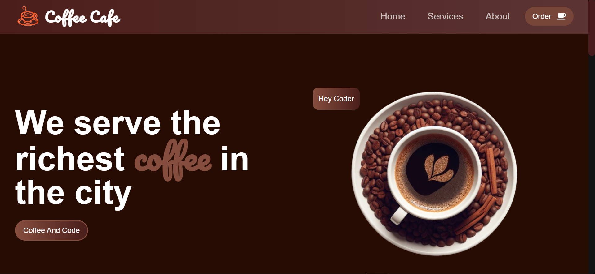

# Coffee Cafe - Frontend Website ☕

A modern, responsive coffee shop website built with React, Vite, and Tailwind CSS (optional). Features menu browsing, online ordering, store locator, and more.

 

## Live Demo

👉 [https://coffee-cafe-reactjs.netlify.app/]

## Features ✨

- **Responsive Design**: Works seamlessly on mobile, tablet, and desktop
- **Interactive Menu**: Browse coffee selections with filters and categories
- **Online Ordering**: Add items to cart and proceed to checkout
- **Customer Reviews**: Testimonials with star ratings
- **Promotional Sections**: Highlight seasonal drinks and specials

## Technologies Used 🛠️

- ⚛️ React 
- ⚡ Vite (for fast development builds)
- 🎨 Tailwind CSS (or your preferred styling solution)
- 🗺️ React Icons (for beautiful icons)
- 📱 Fully responsive design
- 🚀 Optimized performance

## Getting Started

### Prerequisites

- Node.js 
- npm 

### Installation

1. Clone the repository:
   ```bash
   git clone https://github.com/rashirajasinghe/coffee-web.git
